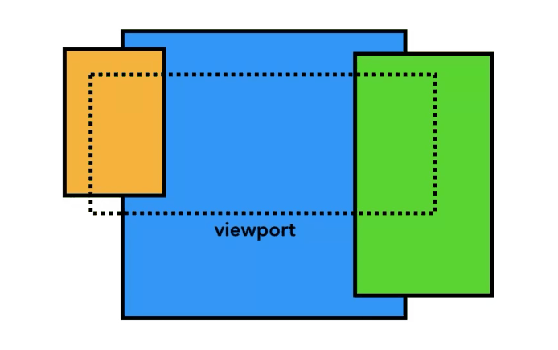

::: tip
文章原地址: https://developer.chrome.com/blog/inside-browser-part4/

原文章发表于 2018.9.21，更新于：2019.1.12
:::

## 输入即将进入合成器

> Input is coming to the Compositor

这是 4 部分博客系列的最后一部分，探讨了 Chrome 内部;调查它如何处理我们的代码以显示网站。在上一篇文章中，我们查看了渲染过程并了解了合成器。在这篇文章中，我们将看看合成器如何在用户输入时实现流畅的交互。

> This is the last of the 4 part blog series looking inside of Chrome; investigating how it handles our code to display a website. In the previous post, we looked at [the rendering process and learned about the compositor](https://developers.google.com//web/updates/2018/09/inside-browser-part3). In this post, we'll look at how compositor is enabling smooth interaction when user input comes in.

## 从浏览器的角度输入事件

> Input events from the browser's point of view

当您听到“输入事件”时，您可能只会想到在文本框中键入或单击鼠标，但从浏览器的角度来看，输入意味着来自用户的任何手势。鼠标滚轮滚动是输入事件，触摸或鼠标悬停也是输入事件。

> When you hear "input events" you might only think of a typing in textbox or mouse click, but from the browser's point of view, input means any gesture from the user. Mouse wheel scroll is an input event and touch or mouse over is also an input event.

当用户在屏幕上出现触摸等手势时，浏览器进程是首先接收手势的进程。但是，浏览器进程仅知道该手势发生的位置，因为选项卡内的内容由呈现器进程处理。因此，浏览器进程将事件类型（如 `touchstart` ）及其坐标发送到渲染器进程。呈现器进程通过查找事件目标并运行附加的事件侦听器来适当地处理事件。

> When user gesture like touch on a screen occurs, the browser process is the one that receives the gesture at first. However, the browser process is only aware of where that gesture occurred since content inside of a tab is handled by the renderer process. So the browser process sends the event type (like `touchstart`) and its coordinates to the renderer process. Renderer process handles the event appropriately by finding the event target and running event listeners that are attached.


图 1：通过浏览器进程路由到渲染器进程的输入事件

> Figure 1: Input event routed through the browser process to the renderer process

## 合成器接收输入事件

> Compositor receives input events



图 2：将鼠标悬停在页面图层上的视口

> Figure 2: Viewport hovering over page layers

在上一篇文章中，我们研究了合成器如何通过合成栅格化图层来平滑处理滚动。如果没有输入事件侦听器附加到页面，则 Compositor 线程可以创建一个完全独立于主线程的新复合帧。但是，如果将某些事件侦听器附加到页面怎么办？合成器线程如何确定是否需要处理事件？

> In the previous post, we looked at how the compositor could handle scroll smoothly by compositing rasterized layers. If no input event listeners are attached to the page, Compositor thread can create a new composite frame completely independent of the main thread. But what if some event listeners were attached to the page? How would the compositor thread find out if the event needs to be handled?

## 了解非快速可滚动区域

> Understanding non-fast scrollable region

由于运行 JavaScript 是主线程的工作，因此在合成页面时，合成器线程会将附加了事件处理程序的页面区域标记为“非快速可滚动区域”。通过获取此信息，合成器线程可以确保在事件发生在该区域时将输入事件发送到主线程。如果输入事件来自此区域之外，则合成器线程将继续合成新帧，而无需等待主线程。

> Since running JavaScript is the main thread's job, when a page is composited, the compositor thread marks a region of the page that has event handlers attached as "Non-Fast Scrollable Region". By having this information, the compositor thread can make sure to send input event to the main thread if the event occurs in that region. If input event comes from outside of this region, then the compositor thread carries on compositing new frame without waiting for the main thread.


图 3：描述到非快速可滚动区域的输入图

> Figure 3: Diagram of described input to the non-fast scrollable region

### 编写事件处理程序时要注意

> Be aware when you write event handlers

Web 开发中常见的事件处理模式是事件委派。由于事件冒泡，您可以在最顶层元素附加一个事件处理程序，并根据事件目标委派任务。您可能已经看到或编写了如下所示的代码。

> A common event handling pattern in web development is event delegation. Since events bubble, you can attach one event handler at the topmost element and delegate tasks based on event target. You might have seen or written code like the below.

```js
document.body.addEventListener("touchstart", (event) => {
  if (event.target === area) {
    event.preventDefault();
  }
});
```

由于您只需要为所有元素编写一个事件处理程序，因此此事件委托模式的人体工程学很有吸引力。但是，如果您从浏览器的角度查看此代码，现在整个页面都被标记为非快速可滚动区域。这意味着，即使应用程序不关心来自页面某些部分的输入，合成器线程也必须与主线程通信，并在每次输入事件进入时等待它。因此，合成器的平滑滚动能力被击败了。

> Since you only need to write one event handler for all elements, ergonomics of this event delegation pattern are attractive. However, if you look at this code from the browser's point of view, now the entire page is marked as a non-fast scrollable region. This means even if your application doesn't care about input from certain parts of the page, the compositor thread has to communicate with the main thread and wait for it every time an input event comes in. Thus, the smooth scrolling ability of the compositor is defeated.


图 4：覆盖整个页面的非快速可滚动区域的描述输入图

> Figure 4: Diagram of described input to the non-fast scrollable region covering an entire page

为了减少这种情况的发生，您可以在事件侦听器中传递 `passive: true` 选项。这向浏览器暗示您仍然希望在主线程中侦听事件，但合成器也可以继续合成新帧。

> In order to mitigate this from happening, you can pass `passive: true` options in your event listener. This hints to the browser that you still want to listen to the event in the main thread, but compositor can go ahead and composite new frame as well.

```js
document.body.addEventListener(
  "touchstart",
  (event) => {
    if (event.target === area) {
      event.preventDefault();
    }
  },
  { passive: true }
);
```

## 检查活动是否可取消

> Check if the event is cancelable


图 5：将部分页面固定为水平滚动的网页

> Figure 5: A web page with part of the page fixed to horizontal scroll

假设您在页面中有一个框，您希望将滚动方向限制为仅水平滚动。

> Imagine you have a box in a page that you want to limit scroll direction to horizontal scroll only.

在指针事件中使用 `passive: true` 选项意味着页面滚动可以平滑，但垂直滚动可能已在您希望 `preventDefault` 时开始，以限制滚动方向。您可以使用 `event.cancelable` 方法对此进行检查。

> Using `passive: true` option in your pointer event means that the page scroll can be smooth, but vertical scroll might have started by the time you want to `preventDefault` in order to limit scroll direction. You can check against this by using `event.cancelable` method.

```js
document.body.addEventListener(
  "pointermove",
  (event) => {
    if (event.cancelable) {
      event.preventDefault(); // block the native scroll
      /*
       *  do what you want the application to do here
       */
    }
  },
  { passive: true }
);
```

或者，您可以使用 CSS 规则（如 0）来完全消除事件处理程序。

> Alternatively, you may use CSS rule like `touch-action` to completely eliminate the event handler.

```css
#area {
  touch-action: pan-x;
}
```

## 查找事件目标

> Finding the event target


图 6：查看油漆记录的主线程询问在 x.y 点上绘制了什么

> Figure 6: The main thread looking at the paint records asking what's drawn on x.y point

当合成器线程将输入事件发送到主线程时，首先要运行的是命中测试以查找事件目标。命中测试使用绘制记录在呈现过程中生成的数据来找出事件发生的点坐标下方的内容。

> When the compositor thread sends an input event to the main thread, the first thing to run is a hit test to find the event target. Hit test uses paint records data that was generated in the rendering process to find out what is underneath the point coordinates in which the event occurred.

## 最小化到主线程的事件调度

> Minimizing event dispatches to the main thread

在上一篇文章中，我们讨论了我们的典型显示器如何每秒刷新屏幕 60 次，以及我们需要如何跟上流畅动画的节奏。对于输入，典型的触摸屏设备每秒传递 60-120 次触摸事件，典型的鼠标每秒传递 100 次事件。输入事件的保真度高于屏幕可以刷新的保真度。

> In the previous post, we discussed how our typical display refreshes screen 60 times a second and how we need to keep up with the cadence for smooth animation. For input, a typical touch-screen device delivers touch event 60-120 times a second, and a typical mouse delivers events 100 times a second. Input event has higher fidelity than our screen can refresh.

如果像 `touchmove` 这样的连续事件每秒发送到主线程 120 次，那么与屏幕刷新的速度相比，它可能会触发过多的命中测试和 JavaScript 执行。

> If a continuous event like `touchmove` was sent to the main thread 120 times a second, then it might trigger excessive amount of hit tests and JavaScript execution compared to how slow the screen can refresh.


图 7：充斥帧时间轴的事件导致页面卡顿

> Figure 7: Events flooding the frame timeline causing page jank

为了尽量减少对主线程的过多调用，Chrome 会合并连续事件（例如 `wheel` 、 `mousewheel` 、 `mousemove` 、 `pointermove` 、 `touchmove` ），并将调度延迟到下一个 `requestAnimationFrame` 之前。

> To minimize excessive calls to the main thread, Chrome coalesces continuous events (such as `wheel`, `mousewheel`, `mousemove`, `pointermove`, `touchmove` ) and delays dispatching until right before the next `requestAnimationFrame`.


图 8：与之前相同的时间线，但事件被合并并延迟

> Figure 8: Same timeline as before but event being coalesced and delayed

任何离散事件（如 `keydown` 、 keyup 、2、3、 touchstart 和 touchend ）都会立即调度。

> Any discrete events like `keydown`, `keyup`, `mouseup`, `mousedown`, `touchstart`, and `touchend` are dispatched immediately.

## 使用 `getCoalescedEvents` 获取帧内事件

> Use `getCoalescedEvents` to get intra-frame events

对于大多数 Web 应用程序，合并事件应该足以提供良好的用户体验。但是，如果您正在构建诸如绘制应用程序并基于 `touchmove` 坐标放置路径之类的东西，则可能会丢失绘制平滑线的中间坐标。在这种情况下，可以在指针事件中使用 `getCoalescedEvents` 方法来获取有关这些合并事件的信息。

> For most web applications, coalesced events should be enough to provide a good user experience. However, if you are building things like drawing application and putting a path based on `touchmove` coordinates, you may lose in-between coordinates to draw a smooth line. In that case, you can use the `getCoalescedEvents` method in the pointer event to get information about those coalesced events.


图 9：左侧是平滑的触摸手势路径，右侧是合并的有限路径

> Figure 9: Smooth touch gesture path on the left, coalesced limited path on the right

```js
window.addEventListener("pointermove", (event) => {
  const events = event.getCoalescedEvents();
  for (let event of events) {
    const x = event.pageX;
    const y = event.pageY;
    // draw a line using x and y coordinates.
  }
});
```

## 后续步骤

> Next steps

在本系列中，我们介绍了 Web 浏览器的内部工作原理。如果您从未想过为什么 DevTools 建议在事件处理程序上添加 `{passive: true}` ，或者为什么您可能会在脚本标记中编写 `async` 属性，我希望本系列能够阐明为什么浏览器需要这些信息来提供更快、更流畅的 Web 体验。

> In this series, we've covered inner workings of a web browser. If you have never thought about why DevTools recommends adding `{passive: true}` on your event handler or why you might write `async` attribute in your script tag, I hope this series shed some light on why a browser needs those information to provide faster and smoother web experience.

## 使用灯塔

> Use Lighthouse

如果你想让你的代码对浏览器很好，但不知道从哪里开始，Lighthouse 是一个工具，可以对任何网站进行审计，并给你一个关于什么是正确的，什么是需要改进的报告。通读审核列表还可以让您了解浏览器关心什么样的事情。

> If you want to make your code be nice to the browser but have no idea where to start, [Lighthouse](https://developer.chrome.com/docs/lighthouse/overview/) is a tool that runs audit of any website and gives you a report on what's being done right and what needs improvement. Reading through the list of audits also gives you an idea of what kind of things a browser cares about.

## 了解如何衡量效果

> Learn how to measure performance

性能调整可能因网站而异，因此衡量网站性能并确定最适合您网站的内容至关重要。Chrome DevTools 团队提供了一些关于如何衡量网站性能的教程。

> Performance tweaks may vary for different sites, so it is crucial that you measure the performance of your site and decide what fits the best for your site. Chrome DevTools team has few tutorials on [how to measure your site's performance](https://developers.google.com/web/tools/chrome-devtools/speed/get-started).

## 向网站添加功能策略

> Add Feature Policy to your site

如果要执行额外的步骤，功能策略是一项新的 Web 平台功能，可以在生成项目时充当护栏。启用功能策略可保证应用的某些行为，并防止你犯错误。例如，如果要确保应用永远不会阻止分析，则可以在同步脚本策略上运行应用。启用 `sync-script: 'none'` 时，将阻止解析器阻塞 JavaScript 执行。这可以防止任何代码阻止解析器，并且浏览器无需担心暂停解析器。

> If you want to take an extra step, [Feature Policy](https://developers.google.com/web/updates/2018/06/feature-policy) is a new web platform feature that can be a guardrail for you when you are building your project. Turning on feature policy guarantees the certain behavior of your app and prevents you from making mistakes. For example, If you want to ensure your app will never block the parsing, you can run your app on synchronous scripts policy. When `sync-script: 'none'` is enabled, parser-blocking JavaScript will be prevented from executing. This prevents any of your code from blocking the parser, and the browser doesn't need to worry about pausing the parser.

## 总结

> Wrap up


当我开始建立网站时，我几乎只关心如何编写代码以及什么可以帮助我提高工作效率。这些事情很重要，但我们也应该考虑浏览器如何获取我们编写的代码。现代浏览器已经并将继续投资于为用户提供更好的 Web 体验的方法。反过来，通过组织我们的代码来善待浏览器，可以改善您的用户体验。我希望你和我一起追求对浏览器友好！

> When I started building websites, I almost only cared about how I would write my code and what would help me be more productive. Those things are important, but we should also think about how browser takes the code we write. Modern browsers have been and continue to invest in ways to provide a better web experience for users. Being nice to the browser by organizing our code, in turn, improves your user experience. I hope you join me in the quest to be nice to the browsers!

非常感谢所有审查本系列早期草稿的人，包括（但不限于）：亚历克斯·拉塞尔、保罗·爱尔兰、梅金·科尔尼、埃里克·比德尔曼、马蒂亚斯·拜恩斯、艾迪·奥斯马尼、安田纪子、纳斯科·奥斯科夫和查理·雷斯。

> Huge thank you to everyone who reviewed early drafts of this series, including (but not limited to): [Alex Russell](https://twitter.com/slightlylate), [Paul Irish](https://twitter.com/paul_irish), [Meggin Kearney](https://twitter.com/MegginKearney), [Eric Bidelman](https://twitter.com/ebidel), [Mathias Bynens](https://twitter.com/mathias), [Addy Osmani](https://twitter.com/addyosmani), [Kinuko Yasuda](https://twitter.com/kinu), [Nasko Oskov](https://twitter.com/nasko), and Charlie Reis.

你喜欢这个系列吗？如果您对未来的帖子有任何疑问或建议，我很乐意在下面的评论部分或 Twitter 上@kosamari 收到您的来信。

> Did you enjoy the this series? If you have any questions or suggestions for the future post, I'd love to hear from you in the comment section below or [@kosamari](https://twitter.com/kosamari) on Twitter.
